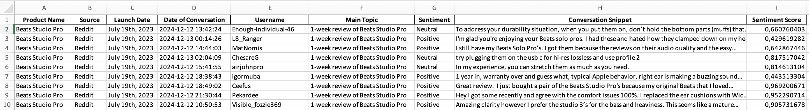
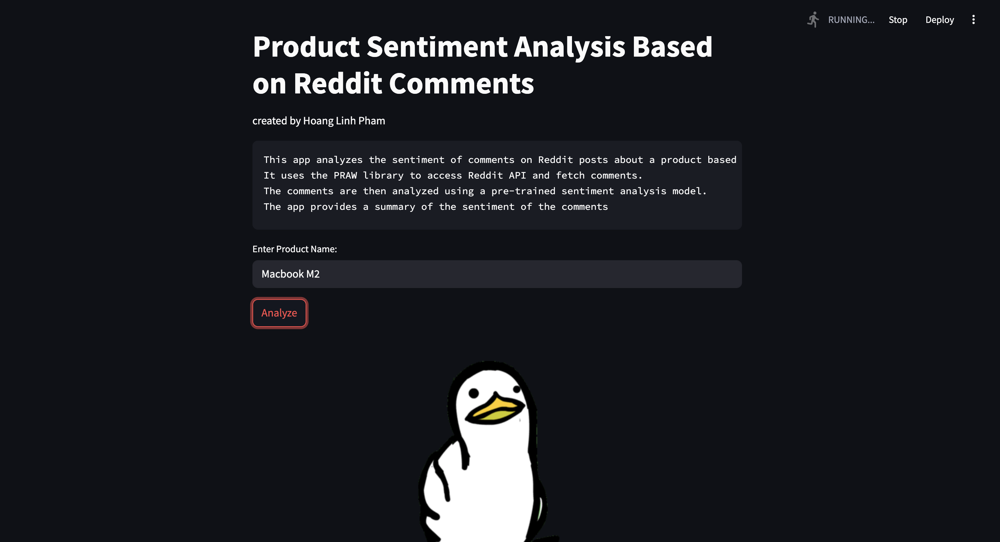
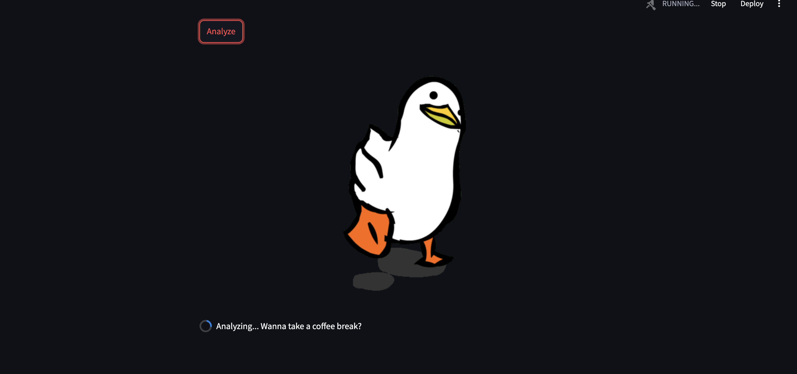

# Beats Product Sentiment Analysis 🚀  
### NLP-Powered Reddit Comment Scraper with Automated Pipeline

A Python-based data pipeline that:
- Automatically **extracts** Reddit comments from selected posts
- **Analyzes** them using a fine-tuned RoBERTa sentiment model
- Classifies sentiment into **Positive**, **Neutral**, or **Negative**
- Converts sentiment scores into a simplified 1–5 star rating
- Saves data to Excel for reporting
- Set up Apache Airflow and Docker for workflow orchestration and future dashboarding

## Roadmap
- [x] Reddit sentiment scraping via url as user input
- [x] Hugging Face integration
- [ ] Reddit sentiment scraping via name of product and url at the same time
- [ ] Airflow pipeline automation
- [ ] Dashboard visualization
- [ ] Cloud deployment (AWS/GCP)
- [ ] Change to yangheng/deberta-v3-base-absa-v1.1 Model for better result

## Output Review

